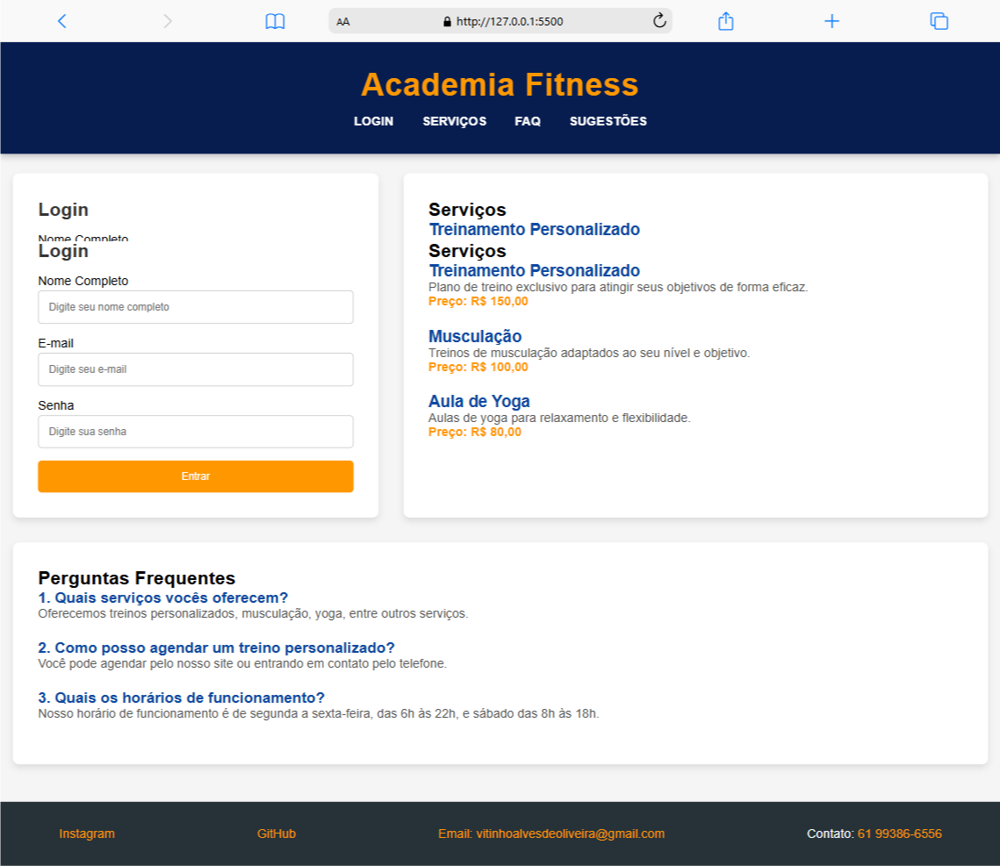

# Academia Fitness - Projeto Web

Este é um projeto de uma página web para uma academia fictícia, com um layout moderno e responsivo. O site oferece seções de Login, Serviços, Perguntas Frequentes (FAQ), e um rodapé com informações de contato e redes sociais.

## Descrição do Projeto

O objetivo deste projeto é criar uma página de apresentação para uma academia. O layout é responsivo, com foco em uma boa experiência tanto para desktop quanto para dispositivos móveis. A navegação é intuitiva, com links fixos no topo da página que direcionam para as seções de **Login**, **Serviços** e **FAQ**. 

O projeto utiliza HTML, CSS e técnicas de design responsivo para garantir que o site tenha uma boa aparência em diferentes dispositivos, incluindo smartphones e notebooks.

## Paleta de Cores

- **Azul Escuro**: `#071d50` — Cor principal para o cabeçalho e fundo.
- **Laranja Claro**: `#FF9800` — Cor para destaque, utilizada no título e no botão de login.
- **Laranja Escuro**: `#FF5722` — Cor para o hover dos links.
- **Cinza Claro**: `#f5f5f5` — Cor de fundo da página.
- **Cinza Escuro**: `#263238` — Cor de fundo do rodapé e links de contato.

## Tipografia

- **Fonte Primária**: `Arial`, sans-serif — Utilizada em todo o site para garantir legibilidade e simplicidade.
- **Fonte Secundária**: `Roboto`, sans-serif — Usada para detalhes e pequenos textos como botões e menus.

## Lista de Tarefas do Projeto

- [x] Criar a estrutura HTML básica com seções de Login, Serviços e FAQ.
- [x] Estilizar a página com CSS para um layout responsivo.
- [x] Implementar um cabeçalho fixo com links de navegação.
- [x] Criar um rodapé com links de redes sociais e informações de contato.
- [x] Adicionar interatividade aos links de navegação, direcionando para as seções específicas.
- [x] Testar a responsividade da página em dispositivos móveis e desktop.
- [x] Finalizar o design com ajustes de cores e tipografia.
- [x] Adicionar mockups (mobile e notebook).
- [x] Documentar o projeto em um README.md.

## Mockups

### Mobile

.png)

*O mockup acima mostra como o layout se adapta em dispositivos móveis, com o menu de navegação em formato de coluna para facilitar o acesso a cada seção.*

### Notebook/Desktop

*O mockup de desktop mostra a página com um layout de três colunas, onde o conteúdo é distribuído de forma organizada entre o Login, Serviços e FAQ.*

## Informações de Contato

Se você tiver alguma dúvida ou sugestão, fique à vontade para entrar em contato:

- **Email**: [vitinhoalvesdeoliveira@gmail.com](mailto:vitinhoalvesdeoliveira@gmail.com)
- **Telefone**: [+55 61 99386-6556](tel:+5561993866556)
- **GitHub**: [https://github.com/seuGitHub](https://github.com/seuGitHub)
- **Instagram**: [https://www.instagram.com/seuInstagram](https://www.instagram.com/seuInstagram)

## Link de Acesso ao Site

Acesse o site aqui: [https://seulink.com](https://seulink.com)

> **Nota**: Este link é um exemplo. Substitua-o pelo link real quando o site estiver hospedado.

## Tecnologias Utilizadas

- [**HTML**](https://developer.mozilla.org/en-US/docs/Web/HTML) - Linguagem de marcação para estruturar o conteúdo da página.
- [**CSS**](https://developer.mozilla.org/en-US/docs/Web/CSS) - Estilização da página, utilizando layout flexível e design responsivo.
- [**JavaScript (opcional)**](https://developer.mozilla.org/en-US/docs/Web/JavaScript) - Linguagem de programação (não implementada neste projeto, mas poderia ser utilizada para funcionalidades interativas).
- [**GitHub Pages**](https://pages.github.com/) - Para hospedar o site (se você usar essa plataforma para publicação).
